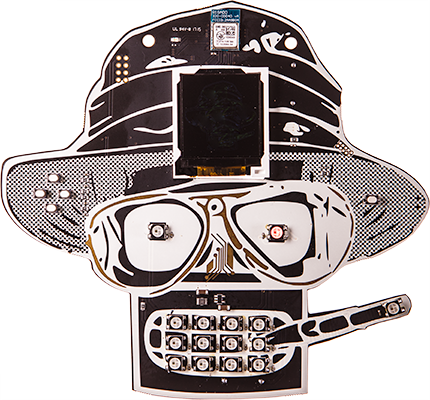
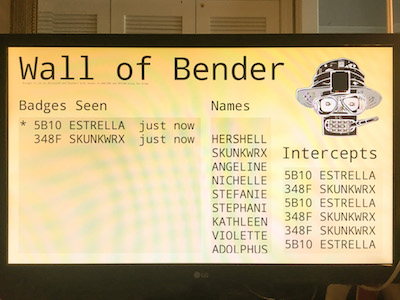

# Wall of Bender at DEFCON 25

Brought to you by Abraxas3D and Skunkwrx.

[Wall of Bender on GitHub](https://github.com/MustBeArt/wallofbender)

## Introduction

The **Wall of Bender** is a logger and display board for the
[AND!XOR DC25 Badge](https://hackaday.io/project/19121-andxor-dc25-badge),
aka the Bender Badge at
[DEFCON](https://www.defcon.org) 25
(2017 at Caesar's Palace). The badge has a Bluetooth Low Energy (BLE)
radio, which it uses to implement a multiplayer botnet game between the
badges (among other things). Each badge is constantly transmitting its
unique ID, player name, and other game info in BLE advertisement format.
The Wall listens for these advertisements, logs them all to a file, and
displays them in a friendly format for the amusement and edification of
passers-by.

Three windows are displayed. A smaller window displays just the names and
unique IDs of each and every badge advertisement received, in real time,
even if they go by too fast to read. A bigger window displays the same
information plus a time-since-last-heard indication, and smooth scrolls
the entire stored list, after removing duplicates based on the BLE
advertising address transmitted. In between, another smooth-scrolled
window shows just the names received, regardless of which badge sent them.

## Hardware

We deployed the Wall of Bender on a
[Raspberry Pi Zero W](https://www.raspberrypi.org/products/raspberry-pi-zero-w/),
which has its own built-in Bluetooth hardware. Any Linux-based computer
with a Bluetooth adapter capable of supporting BLE under the standard
[BlueZ Bluetooth stack](http://www.bluez.org) should theoretically work fine.

We used a [LG 24M38H](http://www.lg.com/us/monitors/lg-24M38H-B-led-monitor)
HDMI monitor at 1920x1080 ("Full HD" 1080P) resolution. Note that the Wall
of Bender is hard-coded for this resolution and will look terrible at any
other resolution.

## Deployment Notes

### Operating System

We used
[NOOBS](https://www.raspberrypi.org/blog/introducing-noobs/) 2.4.2 to install
[Raspbian](http://raspbian.org) Jessie on an 8GB SD card.

### Dependencies

There were some.

### Screen Blanking

We turned off screen blanking as suggested on
[this web page](http://www.geeks3d.com/hacklab/20160108/how-to-disable-the-blank-screen-on-raspberry-pi-raspbian/)
by adding
    [SeatDefaults]
    xserver-command=X -s 0 -dpms
in the file `/etc/lightdm/lightdm.conf `.

### WiFi

We investigated the possibility of creating the UI as a web page. This was
rejected for the primary UI because the Raspberry Pi seems to be too slow
to run the web browser quickly, and because making the UI look good in the
time available was beyond my skill level as a web developer. I installed
[hostapd](http://w1.fi/hostapd/) to create a standalone network for the
Wall. Following recipes found web pages like
[this one](https://seravo.fi/2014/create-wireless-access-point-hostapd),
I got it working, but it always failed to start hostapd on boot. Starting
hostapd manually after boot worked.

The Wall was serving a web page during the deployment, but it didn't have
any live data on it, so we didn't mention it to anyone.

### Non-Bender Badges

Some of the other unofficial badges at DEFCON 25 were using a compatible
BLE protocol and could interact with the Bender badges. Those transmissions
are not logged by the Wall of Bender, because of the fields within the
advertisement format I chose to filter on.

## Results

The log files are found in the
[logfile archive (.zip)](https://github.com/MustBeArt/wallofbender/blob/master/logfiles.zip).

### Log File Format

The Wall writes a file for each thousand badge advertisements received.
The file is plain text. Each line consists of a timestamp as a floating
point count of seconds (Unix timestamp) and a string of hex representing
the raw data in the advertisement.

### Timestamp Limitation

I failed to account for the fact that the Raspberry Pi Zero W does not
include a realtime clock. Since the Wall did not have access the Internet
(that's a feature when you're deployed at DEFCON in the Wireless Village!)
it could not set its own clock by NTP, as a Linux host normally would.
So, all the timestamps are wrong.

## Gallery

